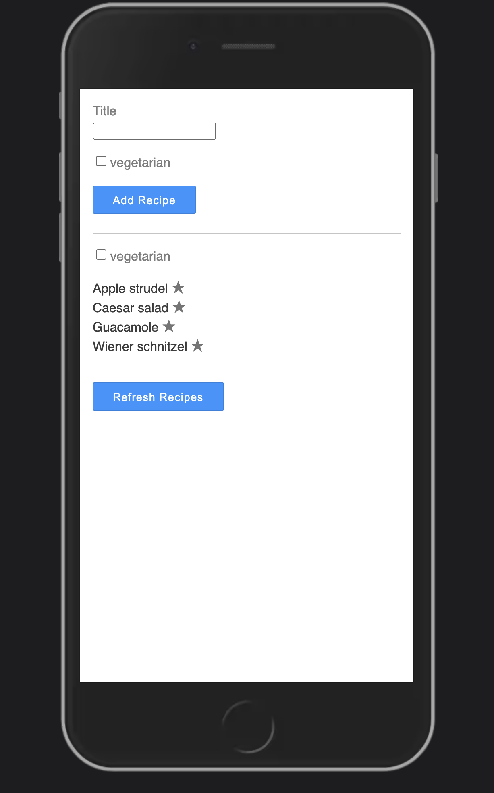

# Graphql apollo-client


Para ejecutar el cliente, debe inicializar la base de datos y ejecutar el servidor de antemano.

```bash
cd server
npm install
npm run seed
npm run start:slow
```

o al usar `yarn`

```bash
cd server
yarn
yarn seed
yarn start:slow
```

Puedes encontrar el servidor ubicado aquí:`./server`

La base de datos almacena dos archivos JSON almacenados en `/tmp/recipes.json` y `/tmp/ingedients.json`.


## Retos para este taller

1. Conectar a React
2. Obtener datos mediante el componente de consulta Apollo
3. Proporcionar argumentos dinámicos en un componente de consulta Apollo con variables GraphQL
4. Actualizar datos usando el componente Apollo Mutation
5. Administre el estado local usando Apollo extendiendo el esquema GraphQL en el cliente
6. Recuperar datos con el componente de consulta Apollo ya sea manualmente o en intervalos programados

## Idea de layout


